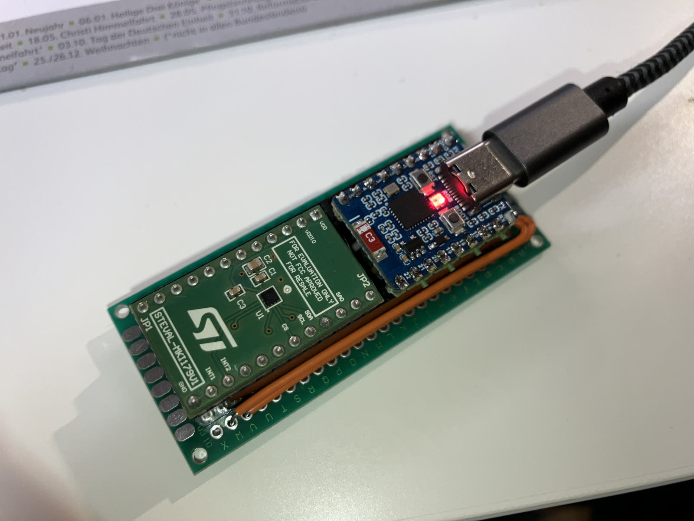
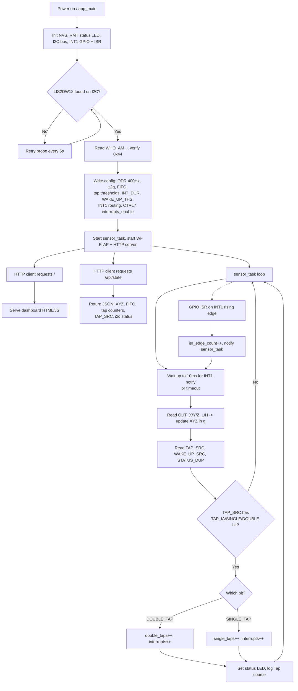

# ESP32-C6 + LIS2DW12 Tap Event Test

Firmware for an ESP32-C6 (DevKitM-1) that reads a LIS2DW12 3-axis accelerometer
over I2C, detects single-/double-tap events using the sensor's built-in tap
recognition engine, and exposes live sensor data through a Wi-Fi access point
with a small web dashboard.

## Hardware

- **MCU**: ESP32-C6-DevKitM-1
- **Sensor**: STMicroelectronics LIS2DW12 (tested on STEVAL-MKI179V1, rigidly
  soldered)
- **Wiring**:
  - I2C SDA: `GPIO0`
  - I2C SCL: `GPIO1`
  - LIS2DW12 `INT1`: `GPIO15`
  - Onboard status LED (WS2812/RMT): `GPIO8`
- **I2C address**: auto-probed at `0x19` (SA0=1) or `0x18` (SA0=0)




## What it does

1. Probes the I2C bus for the LIS2DW12 and verifies `WHO_AM_I == 0x44`.
2. Configures the sensor for 400 Hz / High-Performance mode, ±2 g full scale,
   and enables the hardware single-/double-tap detection engine on all three
   axes (`TAP_THS_X/Y/Z`, `INT_DUR`, `WAKE_UP_THS`, routed to `INT1`).
3. Polls acceleration and `TAP_SRC` roughly every 10 ms (independent of the
   `INT1` GPIO interrupt, which only wakes the task early) and updates single-
   and double-tap counters when a tap is detected.
4. Starts a Wi-Fi access point (`LIS2DW12-Test` / `lis2dw12test`) and a small
   HTTP server serving a live dashboard at `http://192.168.4.1` (polls
   `/api/state` twice a second).
5. Logs a `DATA ...` summary line once per second over serial (115200 baud),
   including XYZ acceleration, `TAP_SRC`, `WAKE_UP_SRC`, `STATUS_DUP`, tap
   counters and the hardware `INT1` edge count.

## Tap detection notes

The tap threshold needed for reliable detection is very setup-dependent (rigid
mounting, board mass, sensor placement). This project currently uses a low
threshold (`TAP_THS_X/Y = 2`, `TAP_THS_Z = 2`) that was empirically verified
to work on a rigid, directly-soldered STEVAL-MKI179V1 board — noticeably lower
than ST's reference example (which uses `12`). If taps aren't detected on a
different mechanical setup, lower the threshold further for diagnosis, then
raise it again once detection is confirmed to reduce false positives.

## Build & flash

```powershell
pio run                # build
pio run --target upload  # flash
pio device monitor       # serial log (115200 baud)
```

## Process flow


