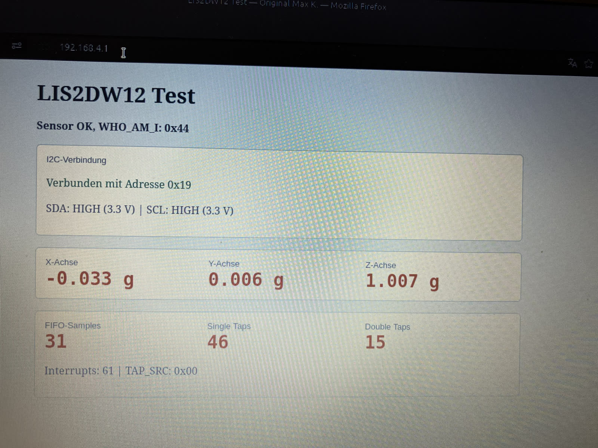
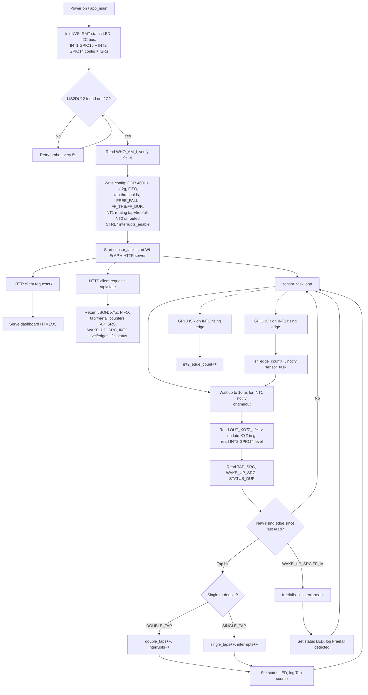

# ESP32-C6 + LIS2DU12 Tap Event Test

Firmware for an ESP32-C6 (DevKitM-1) that reads a LIS2DU12 3-axis accelerometer
over I2C, detects single-/double-tap and freefall events using the sensor's
built-in event engines, and exposes live sensor data through a Wi-Fi access point
with a small web dashboard.

## Hardware

- **MCU**: ESP32-C6-DevKitM-1
- **Sensor**: STMicroelectronics LIS2DU12 (tested on STEVAL-MKI222V1, rigidly
  soldered)
- **Wiring**:
  - I2C SDA: `GPIO0`
  - I2C SCL: `GPIO1`
  - LIS2DU12 `INT1`: `GPIO15` (tap + freefall events)
  - LIS2DU12 `INT2`: `GPIO14` (diagnostic only, no event routed by default)
  - Onboard status LED (WS2812/RMT): `GPIO8`
- **I2C address**: auto-probed at `0x19` (SA0=1) or `0x18` (SA0=0)



## What it does

1. Probes the I2C bus for the LIS2DU12 and verifies `WHO_AM_I == 0x45`.
2. Configures the sensor for 400 Hz / High-Performance mode, ±2 g full scale,
   and enables the hardware single-/double-tap detection engine on all three
   axes (`TAP_THS_X/Y/Z`, `INT_DUR`, `WAKE_UP_THS`) and the freefall engine
   (`FREE_FALL` register), both routed to `INT1` (this sensor has no freefall
   bit on `INT2`).
3. Polls acceleration, `TAP_SRC` and `WAKE_UP_SRC` roughly every 10 ms
   (independent of the `INT1` GPIO interrupt, which only wakes the task early)
   and counts a tap or freefall event only on its rising edge, so a single
   physical event is never counted or logged more than once.
4. Starts a Wi-Fi access point (`LIS2DU12-Test` / `lis2du12test`) and a small
   HTTP server serving a live dashboard at `http://192.168.4.1` (polls
   `/api/state` twice a second).
5. Logs a `DATA ...` summary line once per second over serial (115200 baud),
   including XYZ acceleration, `TAP_SRC`, `WAKE_UP_SRC`, `STATUS_DUP`, tap and
   freefall counters, the `INT1` edge count, and the `INT2` (`GPIO14`) level
   and edge count.
6. Reports the sensor's configured power mode and the ESP32's CPU frequency /
   Wi-Fi power-save mode on the dashboard (see [Power information](#power-information)).

## Freefall detection

The LIS2DU12 hardware event engine raises `WAKE_UP_SRC.FF_IA` (bit 5) when the
measured acceleration modulus stays below the `FF_THS` threshold for `FF_DUR`
samples. Both fields live in the dedicated `FREE_FALL` register (`0x36`),
configured as `FF_THS = 3` (~312 mg) and `FF_DUR = 6` samples (~15 ms at
400 Hz). The event is routed through `CTRL4_INT1_PAD_CTRL` to `INT1` together
with tap events, counted in the firmware, shown in the dashboard, and logged
once per event as `Freefall detected`.

`INT2` (`CTRL5_INT2_PAD_CTRL`) has **no freefall bit** on this sensor — its
bit 4 is `INT2_DRDY_T` (temperature data-ready), not freefall. Freefall can
therefore only be routed to `INT1`; `TAP_SRC` vs. `WAKE_UP_SRC` is used in
software to tell tap and freefall events apart on the shared pin.

`WAKE_UP_THS`/`WAKE_UP_DUR` are unrelated registers used only to select the
single-/double-tap threshold format (bit7 of `WAKE_UP_THS`); they do not affect
freefall.

For a different mechanical setup, adjust `LIS2DU12_REG_FREE_FALL` in
`src/main.c` (`FF_THS` in bits 0-2, `FF_DUR` in bits 3-7, plus the MSB of
`FF_DUR` in bit 7 of `WAKE_UP_DUR`). A real freefall test should be done with
the sensor secured against damage; use the serial `WAKE_UP_SRC` value to
confirm that `FF_IA` (bit 5) is being reported only during genuine freefall,
not continuously.

## INT2 diagnostics (GPIO14)

`CTRL5_INT2_PAD_CTRL` is currently `0x00`, so no event source is routed to
`INT2` and the pin is expected to stay idle LOW. It is still wired to `GPIO14`
and monitored (level + rising-edge count, `INT2`/`INT2_EDGES` in the log and
dashboard) purely for hardware debugging, e.g. to rule out a wiring or sensor
fault independently of `INT1`.

`INT2` can optionally be repurposed for one of these sources (bit in
`MD2_CFG`):

| Bit | Signal | Meaning |
|---|---|---|
| 3 | `DOUBLE_TAP` | Double-tap event |
| 4 | `FF` | Free-fall event |
| 5 | `WU` | Wake-up event |
| 6 | `SINGLE_TAP` | Single-tap event |
| 7 | `SLEEP_CHANGE` | Sleep-state change |

## Power information

There is no current/voltage sensor (e.g. INA219/INA226) on this board, so the
dashboard cannot show real measured mA/mW. Instead it reports the actual
configured power-relevant settings, read back from the hardware:

- **LIS2DU12 mode**: decoded from `CTRL5` (ODR in Hz; LIS2DU12 uses a 12-bit
  low-power data path). Currently configured for 400 Hz.
- **LIS2DU12 typical current**: consult the LIS2DU12 datasheet; exact current
  depends on ODR and configuration and should be measured externally.
- **ESP32 CPU frequency**: read via `esp_rom_get_cpu_ticks_per_us()`.
- **ESP32 Wi-Fi power-save mode**: read via `esp_wifi_get_ps()` after
  `esp_wifi_start()`. Note that in access-point-only mode this setting has
  limited effect, since the radio must stay active to serve beacons/clients.

For real power-consumption numbers, measure the supply current externally
(e.g. with an INA219/INA226 or a bench power analyzer).

## Tap detection notes

The tap threshold needed for reliable detection is very setup-dependent (rigid
mounting, board mass, sensor placement). This project currently uses a low
threshold (`TAP_THS_X/Y = 2`, `TAP_THS_Z = 2`) as a starting point for the
STEVAL-MKI222V1. This is noticeably lower than ST's reference example (which
uses `12`). If taps aren't detected on a
different mechanical setup, lower the threshold further for diagnosis, then
raise it again once detection is confirmed to reduce false positives.

## Build & flash

```powershell
pio run                # build
pio run --target upload  # flash
pio device monitor       # serial log (115200 baud)
```

## Process flow


